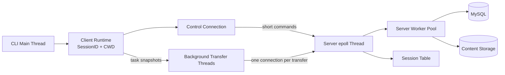

# Cloud Drive Demo Overview

Cloud Drive Demo is a client-server file management system written in C. It provides a command-line interface for account management, remote directory operations, resumable file transfers, and concurrent background uploads and downloads.

The project is currently at Phase 4. This document describes the current system first and then summarizes how each phase contributed to it. Earlier phase documents remain historical records; when their protocol or connection model differs, the Phase 4 behavior is authoritative.

## Current Capabilities

- Register and authenticate application users stored in MySQL/MariaDB.
- Navigate and modify per-user virtual directories with `pwd`, `cd`, `ls`, `mkdir`, `rmdir`, and `rm`.
- Upload with `puts` and download with `gets` while preserving resumable offsets.
- Address physical content by SHA-256 and avoid duplicate upload data through instant upload.
- Remove physical content only after its database reference count reaches zero.
- Keep one persistent control connection for authentication and short commands.
- Run each transfer on an independent TCP connection and background client thread.
- Authorize all non-anonymous requests with a server-issued 16-byte SessionID.
- Share user identity and virtual cwd across all connections in one session.
- Close idle control connections with a timerfd-driven timing wheel without terminating active transfers.
- Reconnect a lost control socket and return the client to the login menu without replaying the failed command.
- Configure networking, database access, storage, logging, server workers, idle timeout, and client transfer limits.

## Current Architecture



The control connection is long-lived and returns to epoll after each short command. A transfer connection is single-purpose: after its first authenticated `puts` or `gets` request, one worker owns the fd until the transfer finishes, then detaches and closes it.

## Protocol And Authentication

The current protocol is TLV2. Every packet uses a 36-byte header containing:

| Field | Size |
| --- | --- |
| Magic | 4 bytes |
| Version | 4 bytes |
| Command | 4 bytes |
| Status | 4 bytes |
| Payload length | 4 bytes |
| SessionID | 16 bytes |

Login and registration requests carry an all-zero SessionID. Successful login creates a random 128-bit SessionID and returns it in the response. Every other request must carry a valid ID, and normal responses echo that ID for client-side validation.

The SessionID is a stateful, in-memory bearer credential rather than a JWT. The server maintains both a SessionID index and an fd index so a session can own one control connection and multiple transfer connections while preventing one fd from switching identities.

## Storage And Transfer Model

MySQL is the authority for user-visible paths and file metadata. Physical bytes are stored separately:

```text
data/files/<sha256_hex>          completed content
data/.upload/<sha256_hex>.part   interrupted upload content
downloads/<name>.part            interrupted client download
```

An upload computes SHA-256 before transfer. If completed content with that hash already exists, the server creates only the logical path and updates its reference count. Otherwise, the server resumes the hash-named partial file, verifies the completed content, publishes it under the content-addressed path, and then records the logical path.

Downloads resolve the user's virtual path through database metadata. The client resumes into a `.part` file, validates the completed SHA-256 digest, and renames the file only after validation succeeds. The server sends download payload bytes with `sendfile`; current uploads use buffered `read` and protocol payloads rather than the Phase 2 `mmap` experiment.

## Session And Connection Lifecycle

```text
successful login
    -> create session and bind control fd

authenticated transfer request
    -> bind new transfer fd to the same SessionID

transfer completes
    -> detach and close only that transfer fd

control connection times out or disconnects
    -> detach and close only the control fd

final bound connection closes
    -> remove and free the session
```

This connection-counted lifecycle allows an already authenticated transfer to finish after the control connection is lost. The client clears its local control-session state, reconnects the socket, and returns to the login menu. It does not automatically reuse credentials, re-authenticate, or replay the command that observed the failure.

## Idle Control Timeout

Accepted sockets are scheduled in a timing wheel driven once per second by a `CLOCK_MONOTONIC` timerfd. The timeout applies to sockets waiting for their next control request:

- A socket is removed from the wheel while a worker handles its request.
- A control socket receives a new absolute deadline when the short command completes and it is returned to epoll.
- A transfer socket leaves the wheel after its authenticated transfer request and stays under worker ownership until close.
- An expired control socket is removed from epoll, detached from its session, shut down, and closed.

Each timer node stores an absolute deadline. Its bucket is `ceil(deadline) % slot_count`, while the wheel advances a current-time cursor. Remaining time decreases as the cursor moves, but the absolute target bucket does not change. Recomputing every node on every tick would produce the same bucket and turn wheel advancement into a full scan.

## Configuration

The server configuration contains:

- `[network]`: listen host, port, and backlog.
- `[mysql]`: database endpoint, credentials, charset, and pool size.
- `[storage]`: completed-content and partial-upload directories.
- `[thread_pool]`: worker count and queue capacity.
- `[session]`: idle control timeout.
- `[log]`: level and output file.

The client configuration contains:

- `[remote]`: server host and port.
- `[storage]`: download directory.
- `[transfer]`: maximum concurrent tasks plus connect and I/O timeouts.
- `[log]`: level and output file.

## Phase Evolution

### Phase 1: Basic Client And Server

Phase 1 established the initial TCP client/server workflow:

- Command parsing and shell-like remote operations.
- An epoll-based server event loop.
- A pthread worker pool.
- TLV1 framing and protocol helpers.
- Configuration and server logging.
- Basic upload and download flows.

The Phase 1 authentication, path layout, TLV1 header, and reusable single-connection model are historical and no longer describe the current implementation.

### Phase 2: Resumable Transfers

Phase 2 added reliability and experimented with large-file optimizations:

- Upload and download offsets for interrupted transfers.
- Protocol data chunks for upload content.
- Server-side `sendfile` for downloads.
- A client-side `mmap` upload path controlled by a size threshold.

Resume behavior and `sendfile` remain in Phase 4. The `mmap` upload path and its configurable threshold are not present in the current source; uploads now use buffered reads.

### Phase 3: Database-Backed Metadata

Phase 3 moved user-visible state into MySQL and separated logical paths from physical content:

- `users`, `paths`, and `files` tables.
- Password verification through `crypt_r`; the salt is embedded in the stored modular password hash.
- Per-user virtual directory trees.
- SHA-256 content addressing and instant upload.
- Reference-counted deletion.
- Hash-named `.part` files for interrupted uploads.
- Verification before completed content and database metadata are published.

Phase 3 still associated identity primarily with one connection. Phase 4 replaced that restriction with SessionID-based multi-connection sessions.

### Phase 4: SessionID And Concurrent Transfers

Phase 4 introduced the current connection and ownership model:

- TLV2 with a 16-byte SessionID in every packet header.
- Random SessionID creation after successful login.
- SessionID and fd hash indexes protected by one session-table mutex.
- One control connection plus multiple independent transfer connections per session.
- Background client transfer threads with immutable SessionID, cwd, and path snapshots.
- Shared session cwd for later requests.
- Connection-counted session lifetime.
- Configurable client transfer concurrency and socket timeouts.
- A monotonic timerfd and timing wheel for idle control connections.
- Automatic control-socket reconnection followed by explicit login, without command replay.

See [Phase 4 Session ID](phase-4-session-id.md) for protocol fields, authorization flow, ownership rules, timing-wheel behavior, configuration, and tests.

## Current Limitations

- SessionIDs are bearer credentials sent over unencrypted TCP; TLS is not implemented.
- Sessions and SessionIDs are process-local and disappear when the server exits.
- There is no explicit logout, server-side revocation, token rotation, or fixed SessionID expiry.
- Idle timeout protects waiting control connections, not workers blocked in a long or stalled transfer.
- Short commands and transfers share the same server worker pool.
- The client reconnects the control socket but does not automatically re-authenticate or replay failed commands.
- Prepared SQL statements, persistent upload-session records, and an orphan-content scanner are not implemented.

## Further Reading

- [Phase 1 basic framework](phase-1-basic.md)
- [Phase 2 resumable transfers](phase-2-resume.md)
- [Phase 3 database-backed metadata](phase-3-database.md)
- [Phase 4 SessionID and connection lifecycle](phase-4-session-id.md)
- [Cross-phase implementation details](details.md)
