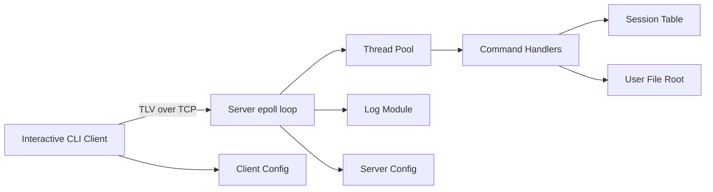
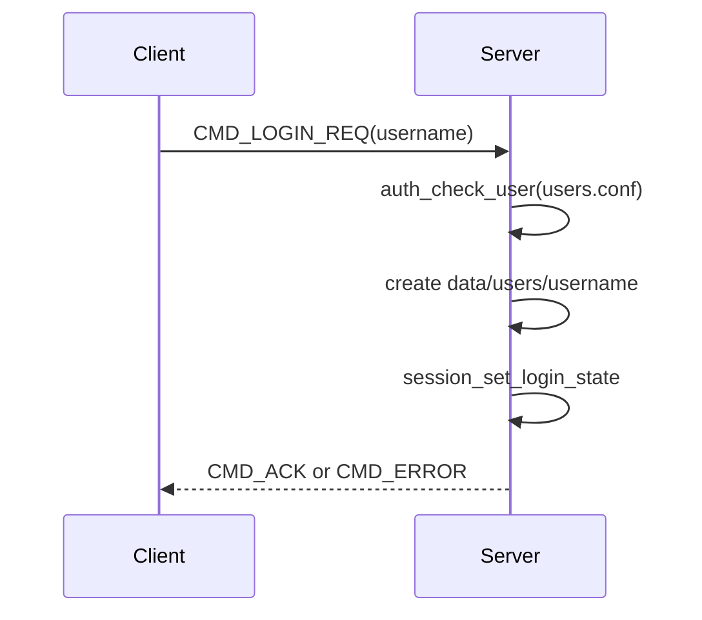
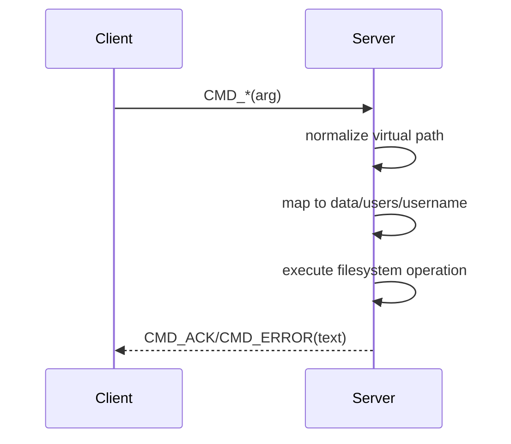
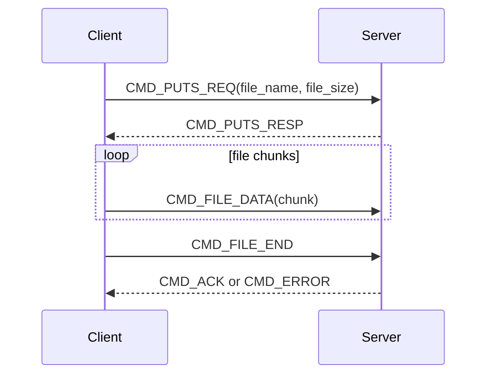
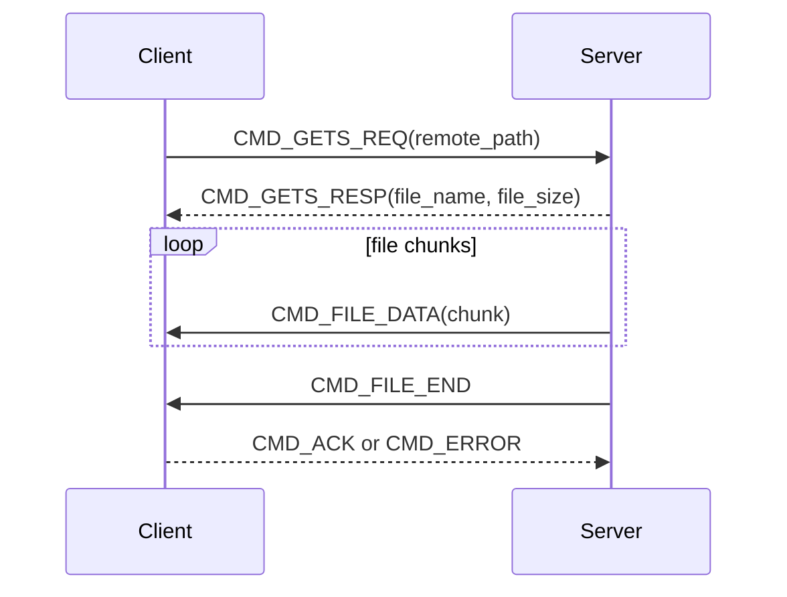

# Phase 1 Basic

Phase 1 implements a basic client/server cloud drive system. The client connects to the server over TCP, logs in with a username, runs file management commands inside the user's own cloud drive directory, and supports basic file upload and download.

[Phase 1 Basic Usage Demo](https://github.com/user-attachments/assets/85da4ad5-ecd6-43ad-b71a-10fdc79ffe54)

## Technology Stack

| Layer | Technology | Current Use |
| --- | --- | --- |
| Language | C | Client, server, shared protocol, and utility modules |
| Build | Makefile + GCC | Builds `bin/cdd-server` and `bin/cdd-client` |
| Networking | TCP socket, `getaddrinfo`, `send`, `recv` | Client connections, server listening, binary packet transfer |
| I/O multiplexing | epoll | Server watches the listen fd, client fds, and self-pipe shutdown event |
| Concurrency | pthread, mutex, condition variable | Server thread pool, thread-safe logging, and session table |
| Protocol | Custom TLV | Commands, status codes, text responses, file metadata, and file chunk transfer |
| Configuration | key-value text files | Server address, port, thread count, log settings, root directory, and user list |
| Logging | Custom log module | Level-based output, written to `logs/server.log` by default |
| Storage | Local filesystem | Each user maps to `data/users/<username>` |

## Project Structure

```text
cloud-drive-demo/
├── Makefile
├── README.md
├── assets/
│   └── videos/
│       └── phase-1-basic-usage-demo.mp4
├── config/
│   ├── client.conf
│   ├── server.conf
│   └── users.conf
├── data/
│   └── users/
│       └── <username>/
├── docs/
│   ├── overview.md
│   └── phase-1-basic.md
├── include/
│   ├── client/
│   ├── common/
│   └── server/
└── src/
    ├── client/
    ├── common/
    └── server/
```

## Architecture



The server main thread handles network event intake: accepting new connections, receiving normal command packets, and submitting work to the thread pool. Normal command tasks are handled by `handle_packet_task`. Long-running `puts` and `gets` transfer tasks temporarily remove the client fd from epoll, complete the synchronous transfer inside the thread pool, and then add the fd back to epoll.

## Modules

### common

- `protocol.c/.h`: defines the TLV protocol, command types, status codes, payload structures, and wraps `send_packet`, `recv_packet`, `send_n`, and `recv_n`.
- `log.c/.h`: implements thread-safe logging with `DEBUG`, `INFO`, `WARN`, and `ERROR` levels.
- `utils.c/.h`: provides safe input helpers, string trimming, path joining, project root detection, recursive directory creation, and basename extraction.

### server

- `main.c`: loads configuration, initializes logging, loads users, creates the listening socket, creates the thread pool, and enters the epoll event loop.
- `network.c/.h`: wraps server listen socket creation and epoll fd registration.
- `thread_pool.c/.h`: implements a producer-consumer task queue with mutexes and condition variables.
- `session.c/.h`: tracks each client fd's login state, username, user root, and virtual current directory.
- `auth_config.c/.h`: loads allowed usernames from `config/users.conf`.
- `handler.c/.h`: implements login, directory commands, file deletion, upload, and download.

### client

- `main.c`: loads client configuration, connects to the server, logs in, and enters the interactive command loop.
- `network.c/.h`: wraps the client TCP connection.
- `auth.c/.h`: reads the username and sends `CMD_LOGIN_REQ`.
- `handler.c/.h`: parses commands, sends requests, handles responses, and performs upload/download.
- `state.h`: stores client connection state, socket fd, username, and remote current directory.

## Protocol Design

The TLV packet header is fixed at 20 bytes:

| Field | Type | Description |
| --- | --- | --- |
| `magic` | `uint32_t` | Fixed `0x544C5631`, ASCII `TLV1` |
| `version` | `uint32_t` | Currently `1` |
| `cmd_type` | `uint32_t` | Command type, such as `CMD_LS` or `CMD_FILE_DATA` |
| `status` | `uint32_t` | Status code, such as `STATUS_OK` or `STATUS_NOT_FOUND` |
| `data_len` | `uint32_t` | Payload length |

The current maximum packet payload is 64 KiB, and each file data block is 4096 bytes. The protocol already defines `CMD_RESUME_POS`, but Phase 1 upload/download uses whole-file transfer and does not implement resume support yet.

Common payloads:

- Text commands: send the path or argument string directly.
- `file_info_payload_t`: file name and file size for `puts`/`gets` metadata exchange.
- `file_chunk_payload_t`: file chunk length plus up to 4096 bytes of file data.

## Command Flows

### Login



### Normal Commands

`pwd`, `cd`, `ls`, `mkdir`, `rmdir`, and `rm` use the same request-response pattern:



The client only sees virtual paths such as `/` and `/docs`. The server maps virtual paths to real paths under `data/users/<username>`. During normalization, the server handles `.`, `..`, absolute paths, and relative paths so the client cannot escape its user root.

### Upload `puts`



The client sends only the local file basename, so the local directory layout is not exposed to the server. The server creates or overwrites a same-name file in the current remote directory.

### Download `gets`



Downloaded files are written to local `downloads/<file_name>`.

## Configuration

`config/server.conf`:

```text
host = 0.0.0.0
port = 8888
backlog = 128
root_dir = data/users
thread_num = 4
queue_capacity = 1024
log_level = info
log_file = logs/server.log
```

`config/client.conf`:

```text
server_ip = 127.0.0.1
server_port = 8888
```

`config/users.conf` stores allowed usernames line by line, for example `alice`, `bob`, `test`, and `daniel`.

## Implemented Commands

| Command | Argument | Description |
| --- | --- | --- |
| `pwd` | none | Prints the remote virtual current directory |
| `cd` | `[path]` | Changes the remote virtual directory; no argument returns to `/` |
| `ls` | `[path]` | Lists directory contents; directory names end with `/` |
| `mkdir` | `<dir>` | Creates a directory |
| `rmdir` | `<dir>` | Removes an empty directory; removing the user root is rejected |
| `rm` | `<file>` | Removes a file |
| `puts` | `<local-file>` | Uploads a local file to the current remote directory |
| `gets` | `<remote-file>` | Downloads a remote file to local `downloads/` |
| `exit` / `quit` | none | Exits the client |

## Build and Run

```bash
make
./bin/cdd-server
./bin/cdd-client
```

Custom configuration files can also be passed explicitly:

```bash
./bin/cdd-server config/server.conf
./bin/cdd-client config/client.conf
```

## Current Phase Boundaries

- Authentication uses only a username allowlist. There are no passwords, password hashes, or database integration.
- File metadata depends entirely on the local filesystem. There is no separate metadata index.
- `puts` overwrites a same-name remote file.
- `gets` overwrites a same-name local file under `downloads/`.
- The protocol reserves `CMD_RESUME_POS`, but Phase 1 does not implement resumable transfer.
