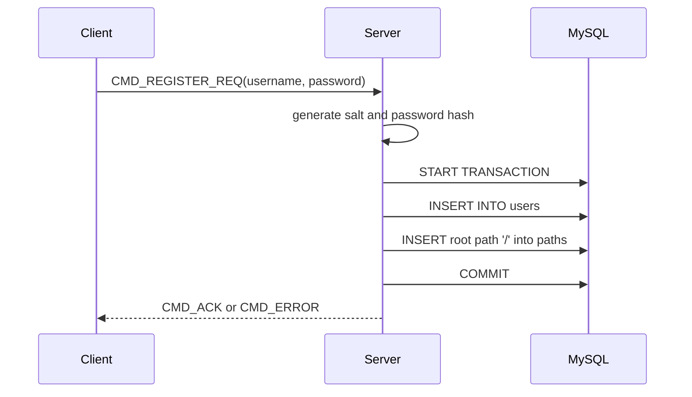
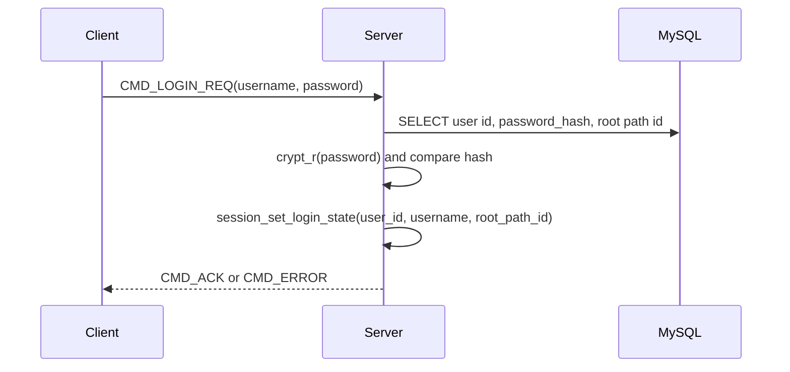
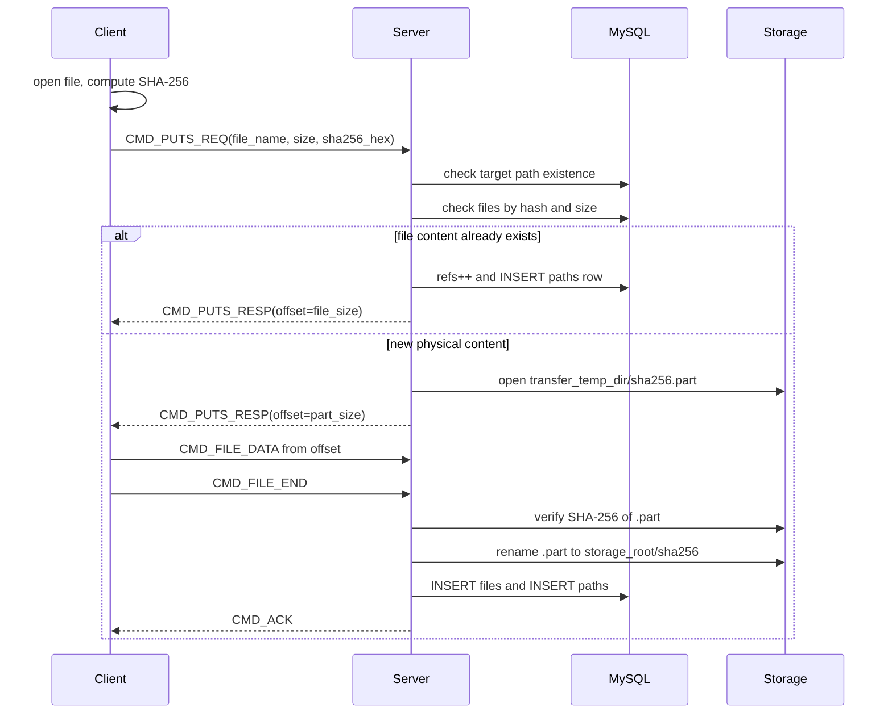
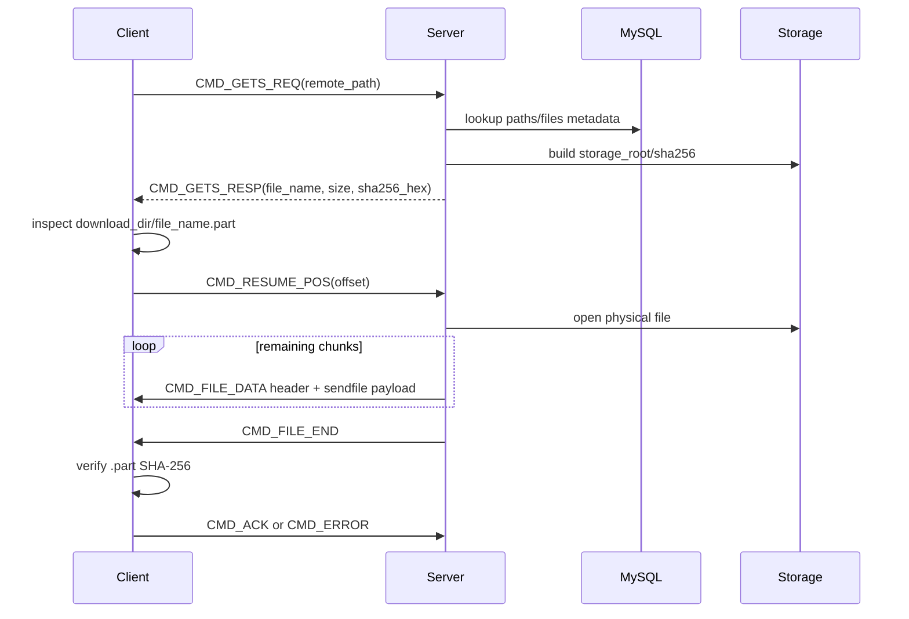

# Phase 3 Database

Phase 3 moves the cloud drive from a filesystem-only model to a database-backed metadata model. The server still stores file bytes on the local filesystem, but users, virtual paths, file metadata, reference counts, and authentication state are now managed through MySQL tables.

This phase keeps the TCP + TLV protocol and the transfer-task model from earlier phases, while changing how the server maps user-visible paths to physical files.

[Phase 3 Usage Demo](https://github.com/user-attachments/assets/20e2f894-3e03-406c-8735-2c968cfd451e)

## Goals

- Store users and password hashes in MySQL instead of a local allowlist.
- Represent each user's virtual directory tree in the `paths` table.
- Store physical file metadata in the `files` table.
- Store physical file content by SHA-256 hash under a shared storage directory.
- Support instant upload when the same content hash already exists.
- Use reference counting so multiple virtual paths can point to one physical file.
- Delete physical files only when their reference count reaches zero.
- Keep resumable `puts` and `gets` working with the new metadata model.

## Technology Stack

| Layer | Technology | Current Use |
| --- | --- | --- |
| Database | MySQL / MariaDB | Stores users, paths, file metadata, hashes, sizes, and reference counts |
| Database Client | `libmysqlclient` | Server-side SQL execution and transaction handling |
| Connection Pool | Custom `database_pool_t` | Reuses MySQL connections across worker threads |
| Authentication | `crypt_r` password hashing | Stores password hashes in `users.password_hash` |
| Hashing | OpenSSL EVP SHA-256 | Computes content hashes for upload verification, instant upload, and download validation |
| Storage | Local filesystem | Stores physical objects under `storage.root_dir` by hash |
| Temporary Uploads | Local `.part` files | Stores interrupted uploads under `storage.transfer_temp_dir` |
| Protocol | Existing TLV protocol | Adds SHA-256 to `file_info_payload_t` and keeps resume packets |
| Concurrency | pthread thread pool | Command handlers and transfer handlers use the shared database pool |

## Layered Architecture

Phase 3 separates command handling, metadata management, and physical storage into clearer layers. The goal is to keep protocol code, business logic, SQL operations, and filesystem operations from being mixed together.

```text
Client CLI
    |
    | TLV over TCP
    v
Server Event Layer
    |
    | packet_task_t / transfer_task_t
    v
Command Handler Layer
    |
    | session state + normalized virtual path
    v
DAO / Metadata Layer
    |
    | SQL queries and transactions
    v
MySQL Metadata Store

Physical file bytes are stored separately:

Command Handler / Transfer Handler
    |
    | storage_root/<sha256_hex>
    | transfer_temp_dir/<sha256_hex>.part
    v
Local Filesystem Storage
```

### Client Layer

The client remains responsible for user interaction, command parsing, local file access, and local transfer state.

For `puts`, the client:

- Opens the local file.
- Computes the full SHA-256 hash.
- Sends `file_info_payload_t` with `file_name`, `file_size`, and `sha256_hex`.
- Sends file data only when the server cannot complete instant upload.

For `gets`, the client:

- Sends the requested remote path.
- Receives remote file metadata.
- Owns the local `.part` file and download resume offset.
- Verifies the final SHA-256 before exposing the downloaded file.

### Protocol Layer

The protocol layer is still the custom TLV packet format. It defines command types, status codes, and payload structures, but it does not know about MySQL tables or physical storage layout.

Examples:

- `CMD_PUTS_REQ`
- `CMD_PUTS_RESP`
- `CMD_GETS_REQ`
- `CMD_GETS_RESP`
- `CMD_RESUME_POS`
- `CMD_FILE_DATA`
- `CMD_FILE_END`
- `CMD_ACK`
- `CMD_ERROR`

This keeps the network protocol stable while the server-side metadata model evolves.

### Event And Task Layer

The server event layer owns socket readiness and task dispatch.

Normal commands use:

```text
epoll -> recv_packet -> packet_task_t -> handle_basic_task
```

Transfer commands use:

```text
epoll -> recv first transfer packet
      -> transfer_task_t
      -> EPOLL_CTL_DEL client fd
      -> handle_transfer_task
      -> EPOLL_CTL_ADD client fd after transfer
```

This prevents the file-transfer stream from being split across unrelated worker tasks.

### Command Handler Layer

The command handler layer owns business flow. It validates request payloads, reads session state, normalizes virtual paths, calls DAO functions, and converts DAO results into protocol responses.

Examples:

- `handle_login` authenticates the user and initializes session state.
- `handle_cd` resolves a virtual path and updates `cwd_id` / `cwd`.
- `handle_rm` removes a logical file path and unlinks the physical file only when the DAO reports that the last reference was removed.
- `handle_puts` coordinates instant upload, resumable upload, hash verification, and metadata insertion.
- `handle_gets` resolves a virtual path to file metadata and sends the physical object to the client.

### Session Layer

The session layer maps a connected client fd to runtime user state.

A session stores:

- `user_id`
- `username`
- `cwd_id`
- `cwd`
- login state
- closing state

Command handlers do not trust the client to send user identity. They derive user context from the session associated with the socket fd.

### DAO / Metadata Layer

The DAO layer owns SQL and database transactions. It hides table-specific details from command handlers.

Examples:

- `dao_auth` handles registration and login metadata.
- `dao_basic` handles virtual path lookup and directory/file command metadata.
- `dao_transfer` handles file linking, file creation, and download metadata lookup.
- `dao_status` provides shared status values such as `DAO_OK`, `DAO_NOT_FOUND`, `DAO_DB_ERROR`, and `DAO_SHOULD_DELETE_PHYSICAL`.

This layer is responsible for keeping `users`, `paths`, and `files` consistent.

### Physical Storage Layer

The filesystem stores only file bytes, not the user-visible directory tree.

Physical files are content-addressed:

```text
storage_root/<sha256_hex>
```

Temporary uploads are stored separately:

```text
transfer_temp_dir/<sha256_hex>.part
```

The database describes where a file appears in each user's virtual tree. The filesystem stores the deduplicated physical content.

### Dependency Direction

The intended dependency direction is one-way:

```text
handlers -> DAO -> database
handlers -> filesystem storage
handlers -> session
protocol -> packet serialization only
```

DAO code should not send packets. Protocol code should not query MySQL. The storage layer should not decide user-visible paths. This separation keeps each layer easier to test, debug, and evolve.

## Database Schema

Phase 3 creates three core tables during server startup.

### `users`

```sql
CREATE TABLE IF NOT EXISTS users (
    id INT AUTO_INCREMENT PRIMARY KEY,
    username VARCHAR(64) NOT NULL UNIQUE,
    password_hash VARCHAR(384) NOT NULL
) ENGINE=InnoDB DEFAULT CHARSET=utf8mb4;
```

The `users` table stores application accounts. Passwords are not stored directly. The server stores the password hash generated during registration.

### `files`

```sql
CREATE TABLE IF NOT EXISTS files (
    id BIGINT AUTO_INCREMENT PRIMARY KEY,
    hash BINARY(32) NOT NULL UNIQUE,
    size BIGINT,
    refs INT NOT NULL DEFAULT 0
) ENGINE=InnoDB DEFAULT CHARSET=utf8mb4;
```

The `files` table describes physical file content.

- `hash` is the SHA-256 digest stored as `BINARY(32)`.
- `size` is the file size in bytes.
- `refs` is the number of logical paths that reference this physical file.

When displaying or using the hash as a file name, SQL queries convert it with:

```sql
LOWER(HEX(hash))
```

### `paths`

```sql
CREATE TABLE IF NOT EXISTS paths (
    id BIGINT AUTO_INCREMENT PRIMARY KEY,
    user_id INT NOT NULL,
    path VARCHAR(768) NOT NULL,
    file_id BIGINT NULL,
    parent_id BIGINT,
    file_name VARCHAR(255) NOT NULL,
    type TINYINT NOT NULL,
    UNIQUE KEY (user_id, path),
    INDEX idx_user_parent (user_id, parent_id)
) ENGINE=InnoDB DEFAULT CHARSET=utf8mb4;
```

The `paths` table represents each user's virtual cloud drive tree.

- `type = 1` means directory.
- `type = 0` means file.
- Directory rows have `file_id = NULL`.
- File rows reference `files.id`.
- `(user_id, path)` is unique, so each user has one node per virtual path.

## Storage Model

Phase 3 separates logical paths from physical file content.

Logical path example:

```text
user view: /docs/readme.md
```

Database representation:

```text
paths(user_id, path='/docs/readme.md', file_id=42, type=0)
files(id=42, hash=<sha256>, size=..., refs=...)
```

Physical storage:

```text
data/files/<sha256_hex>
```

Temporary upload storage:

```text
data/.upload/<sha256_hex>.part
```

This design allows different users, directories, or file names to reference the same physical content. Only one physical copy is stored when hashes and sizes match.

## Configuration

`config/server.conf` contains the database and storage settings:

```ini
[mysql]
host = localhost
port = 3306
user = test
password = 123456
database = cloud_drive_demo
charset = utf8mb4
pool_size = 4

[storage]
root_dir = data/files
transfer_temp_dir = data/.upload
```

At startup, the server:

1. Loads server configuration.
2. Creates the storage root and temporary transfer directory.
3. Initializes the database and creates missing tables.
4. Creates a MySQL connection pool.
5. Starts the thread pool, session table, listen socket, and epoll loop.

## DAO Layer

Phase 3 introduces DAO modules to keep SQL logic out of command handlers.

Current DAO responsibilities include:

- `dao_auth`: registration and login metadata.
- `dao_basic`: virtual path lookup, directory operations, `rm`, and reference count handling.
- `dao_transfer`: file linking, file creation, and download metadata lookup.
- `dao_status`: shared DAO return status values such as `DAO_OK`, `DAO_NOT_FOUND`, `DAO_DB_ERROR`, and `DAO_SHOULD_DELETE_PHYSICAL`.

The DAO layer uses the shared `database_pool_t` to acquire a MySQL connection for each query or transaction.

## Authentication Flow

### Register



Registration creates both the user account and the user's root virtual directory.

### Login



After login, the session stores:

- `user_id`
- `username`
- current virtual path id
- current virtual path string

## Normal Command Flow

Normal commands still follow a request-response pattern, but path state is now database-backed.

### `cd`

```text
CMD_CD(path)
    -> normalize path against session cwd
    -> SELECT id, type FROM paths WHERE user_id=? AND path=?
    -> require type=directory
    -> session_set_cwd(path_id, path)
    -> CMD_ACK(path)
```

### `ls`

```text
CMD_LS([path])
    -> normalize target path
    -> if target is file: return file name
    -> if target is directory: SELECT children by parent_id
    -> CMD_ACK(text listing)
```

### `mkdir`

```text
CMD_MKDIR(path)
    -> normalize target path
    -> ensure parent is directory
    -> INSERT INTO paths(... type=directory ...)
    -> CMD_ACK
```

### `rmdir`

```text
CMD_RMDIR(path)
    -> normalize target path
    -> require target is directory
    -> require no children under parent_id=target_id
    -> DELETE FROM paths WHERE id=target_id
    -> CMD_ACK
```

### `rm`

File deletion is reference-count aware.

```text
CMD_RM(path)
    -> normalize target path
    -> require target is file
    -> dao_rm_file()
        -> DELETE logical path
        -> refs--
        -> if refs == 0:
             DELETE files row
             return DAO_SHOULD_DELETE_PHYSICAL with hash_hex
           else:
             return DAO_OK
    -> if DAO_SHOULD_DELETE_PHYSICAL:
         unlink storage_root/hash_hex
    -> CMD_ACK
```

The handler deletes the physical file only when the DAO reports that the last logical reference has been removed.

## Protocol Changes

Phase 3 extends `file_info_payload_t` with the full SHA-256 hex string:

```c
typedef struct {
    char file_name[NAME_MAX];
    uint64_t file_size;
    char sha256_hex[65];
} file_info_payload_t;
```

This hash is used for:

- Upload deduplication.
- Server-side upload verification.
- Physical object naming.
- Download integrity verification.

The transfer protocol still uses:

- `CMD_PUTS_REQ`
- `CMD_PUTS_RESP`
- `CMD_GETS_REQ`
- `CMD_GETS_RESP`
- `CMD_RESUME_POS`
- `CMD_FILE_DATA`
- `CMD_FILE_END`
- `CMD_ACK`
- `CMD_ERROR`

All `uint64_t` fields are converted with `host_to_net_u64()` and `net_to_host_u64()`.

## Upload Flow: `puts`

The Phase 3 upload path supports resume, hash verification, and instant upload.



Important rules:

- Unfinished uploads stay in `transfer_temp_dir` as `.part` files.
- Unfinished uploads are not inserted into `paths`.
- The server verifies the complete `.part` hash before publishing it.
- Instant upload only creates metadata and increments refs; no file data is transferred.

## Download Flow: `gets`

The Phase 3 download path resolves the user's virtual path through the database and sends the hash-named physical object.



Download resume offset is owned by the client because the partial download file is local.

The client writes to:

```text
download_dir/<file_name>.part
```

After the SHA-256 matches the value from `CMD_GETS_RESP`, the client renames it to:

```text
download_dir/<file_name>
```

## Transfer Task Model

Normal commands and file-transfer commands are handled differently.

For normal commands:

```text
epoll -> recv_packet -> packet_task_t -> thread_pool -> handle_basic_task
```

For `puts` and `gets`:

```text
epoll -> recv first transfer packet
      -> create transfer_task_t
      -> EPOLL_CTL_DEL client fd
      -> worker owns the fd for the full transfer
      -> handle_transfer_task
      -> EPOLL_CTL_ADD client fd after transfer
```

This prevents file data packets from being split across different worker tasks.

## Reference Counting

The `files.refs` field counts logical path references.

Example:

```text
paths:
    /alice/docs/a.txt -> file_id=10
    /bob/share/b.txt  -> file_id=10

files:
    id=10, hash=..., refs=2
```

When one path is removed:

```text
refs: 2 -> 1
physical file remains
```

When the last path is removed:

```text
refs: 1 -> 0
files row is deleted
handler may unlink storage_root/hash
```

The DAO layer decides whether the physical file should be deleted and returns a status such as `DAO_SHOULD_DELETE_PHYSICAL`.

## Data Consistency Notes

Database transactions are used when one logical operation changes multiple tables.

Examples:

- Register user and create root path.
- Link an existing physical file and insert a new path.
- Create a file metadata row and insert a path.
- Remove a path and decrement file refs.

Filesystem operations cannot be rolled back by MySQL. For example, if the database deletion succeeds but `unlink()` fails, the physical file can become an orphan. The recommended operational model is:

- Treat the database state as authoritative for user-visible files.
- Log failed physical cleanup.
- Add a future cleanup task to remove orphaned storage files.

## Current Limitations

- SQL is built with `snprintf`; prepared statements are not yet used.
- Foreign key constraints are not declared in the current schema.
- Physical file cleanup is done synchronously by the command handler.
- There is no background orphan-file scanner yet.
- Upload `.part` cleanup is manual or future work.
