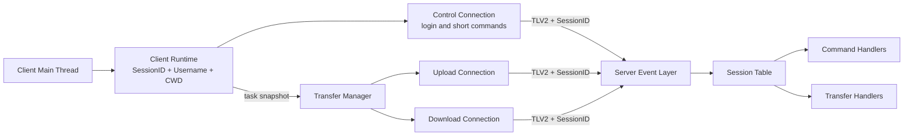
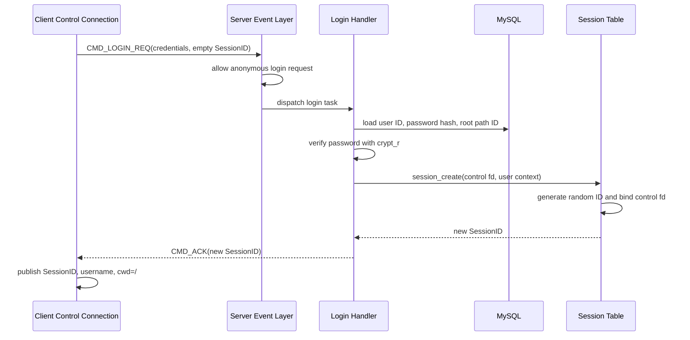
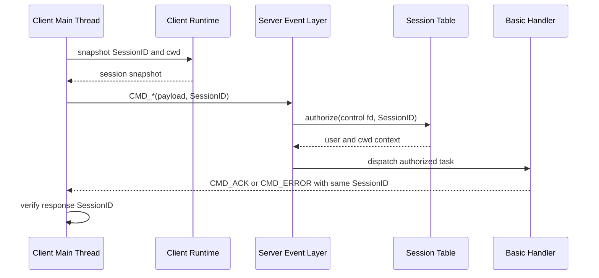
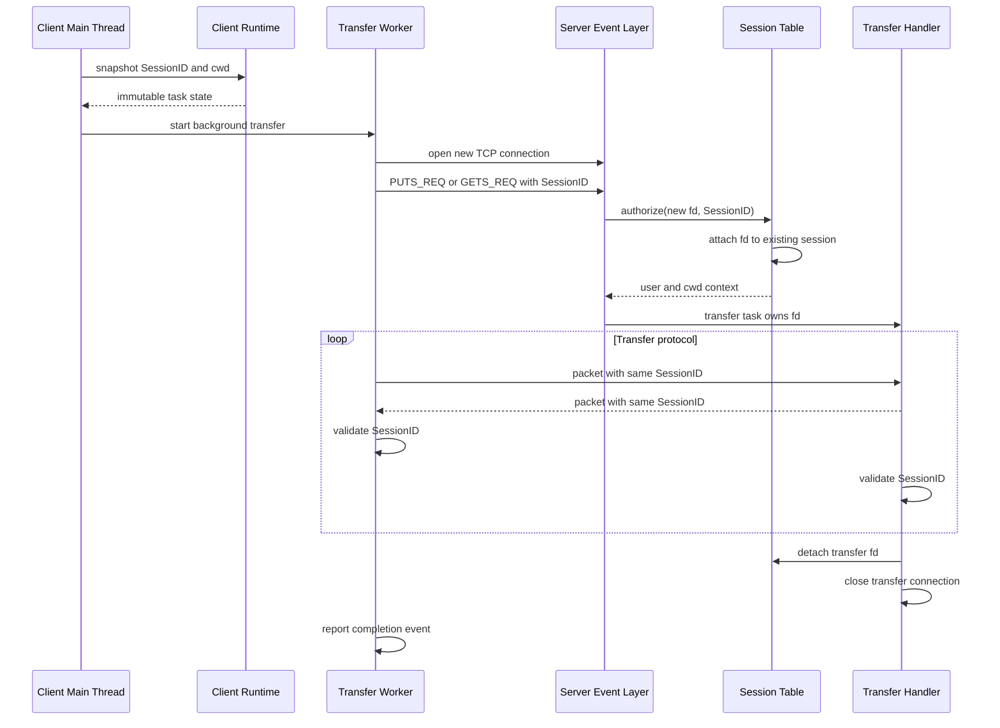

# Phase 4 Session ID

Phase 4 separates interactive control commands from background file transfers. The client keeps one control connection for authentication and short commands, while every `puts` or `gets` task opens an independent transfer connection and runs in a background thread.

Because one logged-in user can now use several TCP connections, a socket fd is no longer sufficient to identify that user. Phase 4 adds a server-issued 16-byte SessionID to the protocol. Every authenticated request carries this ID, allowing control and transfer connections to share the same user identity and virtual current working directory.

The implemented mechanism is a stateful, in-memory session, not a JWT. The server stores each SessionID and its user context until the session's final bound connection closes.

## Goals

- Keep short commands responsive while uploads and downloads run in the background.
- Allow one authenticated client to use multiple TCP connections.
- Identify the user without sending a username and password on every transfer connection.
- Prevent clients from selecting another user's identity through request payloads.
- Share virtual cwd state across all connections in one session.
- Reject empty, unknown, or conflicting SessionIDs before command dispatch.
- Remove session state when its final connection closes.
- Keep session ownership and synchronization explicit on both client and server.

## Architecture



The client uses two connection roles:

- The control connection is opened during startup and remains active for login, registration, and short commands such as `pwd`, `cd`, and `ls`.
- Each transfer task opens a new connection, sends its first `puts` or `gets` request with the current SessionID, completes the transfer, and closes the connection.

The server does not create a session when it accepts a socket. A session is created only after successful login. A later authenticated request can attach its socket to that existing session.

## Protocol Changes

Phase 4 changes the protocol magic and version from TLV1 to TLV2 and appends a SessionID to every packet header.

```c
#define TLV_MAGIC 0x544C5632U
#define TLV_VERSION 2U
#define SESSION_ID_SIZE 16U
#define TLV_WIRE_HEADER_SIZE (20U + SESSION_ID_SIZE)
```

The TLV2 wire header is 36 bytes:

| Offset | Field | Size | Description |
| --- | --- | --- | --- |
| 0 | `magic` | 4 bytes | `0x544C5632`, ASCII `TLV2` |
| 4 | `version` | 4 bytes | Protocol version `2` |
| 8 | `cmd_type` | 4 bytes | Command or response type |
| 12 | `status` | 4 bytes | Status code |
| 16 | `payload_len` | 4 bytes | Payload length, limited to 64 KiB |
| 20 | `session_id` | 16 bytes | Server-issued session identifier |

All integer header fields use network byte order. SessionID bytes are copied unchanged because they are an opaque byte sequence rather than an integer.

The in-memory packet structures are:

```c
typedef struct {
    unsigned char bytes[SESSION_ID_SIZE];
} session_id_t;

typedef struct {
    cmd_type_t type;
    status_code_t status;
    uint32_t payload_len;
    session_id_t session_id;
} packet_header_t;
```

`packet_init()` accepts a SessionID pointer. Passing `NULL` leaves the ID all-zero, which represents an anonymous packet. `session_id_is_empty()` and `session_id_equal()` provide the shared empty-ID and equality checks used by the client and server.

### Anonymous Packets

Only these requests are anonymous:

- `CMD_LOGIN_REQ`
- `CMD_REGISTER_REQ`

They must carry an empty SessionID. The server rejects an anonymous command carrying a non-empty SessionID with `STATUS_BAD_REQUEST`.

Registration responses remain anonymous. A successful login response is the transition point from anonymous to authenticated traffic: it carries the newly created non-empty SessionID.

### Authenticated Packets

All other requests must carry a valid SessionID. The server authorizes the packet before dispatching it to a basic or transfer handler. Authorization failure returns:

```text
CMD_ERROR + STATUS_UNAUTHORIZED
```

Normal responses echo the request SessionID. The client compares every control response and every transfer packet with its expected SessionID and aborts that operation on a mismatch.

## Server Session Model

The session table is implemented by `src/server/session.c`. It has two indexes protected by one mutex:

```text
SessionID hash table
    SessionID -> session_t

fd hash table
    client fd -> connection_binding_t -> session_t
```

The SessionID index allows a newly connected transfer socket to find the authenticated session. The fd index ensures that one socket cannot be attached to two different sessions and makes disconnect cleanup efficient.

### Session State

Each session stores:

- The 16-byte SessionID.
- Database user ID.
- Username.
- Current virtual path ID.
- Current virtual path string.
- Creation timestamp.
- Last activity timestamp.
- Number and list of bound connections.

Handlers receive a copied `session_context_t`:

```c
typedef struct {
    uint64_t user_id;
    uint64_t cwd_id;
    char username[64];
    char cwd[PATH_MAX];
} session_context_t;
```

Request payloads do not contain or override this identity. Command and transfer handlers derive the user ID, username, and cwd from the authorized server session.

### SessionID Generation

`session_create()` generates 16 random bytes with Linux `getrandom()`.

Generation follows these rules:

- Interrupted `getrandom()` calls are retried.
- Short reads continue until all 16 bytes have been filled.
- The all-zero value is rejected because it represents an anonymous packet.
- The generated value is checked against the SessionID hash table.
- Generation is attempted up to eight times if a collision occurs.

The resulting 128-bit random value is opaque to the client. It does not encode the user ID, username, expiry, or other claims.

### Session Creation

After password verification, the login handler calls:

```c
session_create(session_table,
               client_fd,
               user_id,
               username,
               root_path_id,
               &new_session_id);
```

Creation initializes the cwd to `/`, binds the control fd, inserts both indexes, and returns the SessionID in the login `CMD_ACK` header.

One fd cannot create two sessions. A second login attempt on an already bound control connection therefore fails session creation.

### Authorization And Connection Binding

For each non-anonymous request, the event layer calls:

```c
session_authorize(session_table,
                  client_fd,
                  &packet.header.session_id,
                  &session_context);
```

Authorization performs these checks while holding the session-table mutex:

1. The SessionID must be non-empty.
2. The SessionID must identify an existing session.
3. If the fd is already bound, it must belong to that same session.
4. If the fd is not yet bound, a new connection binding is created.
5. The session's last-activity timestamp is updated.
6. User and cwd state are copied into the task's session context.

The first authenticated request on a transfer connection both proves possession of the SessionID and attaches that socket to the session. A socket already attached to one session cannot switch to another SessionID.

### Shared Current Working Directory

`cd` resolves the target path through the database and then calls `session_update_cwd()`. The update is accepted only when the fd is already bound to the specified session.

The updated `cwd_id` and `cwd` belong to the session rather than to one connection. A later authorization from any bound connection receives the same shared state.

The current client additionally snapshots cwd when a transfer is submitted and converts transfer targets into absolute virtual paths. A later `cd` therefore does not redirect a transfer that is already running.

## Login Flow



The client sends login and registration through `exchange_auth()` with a `NULL` SessionID. It accepts login only when the response is `CMD_ACK`, has `STATUS_OK`, and contains a non-empty SessionID.

## Short Command Flow

Short commands use the long-lived control connection synchronously.



For `cd`, the server updates the shared session cwd before sending the normalized path in its response. The client updates its local cwd mirror only after receiving and validating that successful response.

## Background Transfer Flow

The client main thread does not perform transfer I/O. It snapshots the current session and submits an independent task to the transfer manager.



Every packet after the initial transfer request is checked against the SessionID from that request. This prevents a stream from changing identity partway through an upload or download.

Unlike earlier phases, a transfer connection is not returned to epoll for reuse after the transfer. The server detaches and closes it when the transfer handler finishes. The control connection and other transfer connections remain usable.

## Client Session Ownership

`client_runtime_t` stores the active client session:

```text
client_runtime_t
|-- control_fd
|-- session_id
|-- username
|-- remote_cwd
|-- configuration
|-- download directory
`-- transfer manager
```

Session state belongs to the client main thread. Login publishes it, a successful `cd` updates it, and cleanup clears it.

Background workers do not retain a pointer to mutable runtime session fields. `client_runtime_session_snapshot()` copies the SessionID, username, and cwd while the task is submitted. The task also copies its connection settings and normalized paths. This gives each worker stable state without adding a runtime mutex.

All packets sent by a worker use the task's copied SessionID. All received packets are checked against the same copy.

## Session Lifecycle

The server session lifecycle is connection-count based:

```text
successful login
    -> create session
    -> bind control fd (connection_count = 1)

transfer request on new fd
    -> authorize SessionID
    -> bind transfer fd (connection_count++)

transfer completes or disconnects
    -> detach transfer fd (connection_count--)

control connection closes
    -> detach control fd (connection_count--)

connection_count reaches zero
    -> remove SessionID index entry
    -> free session
```

`session_detach_fd()` is idempotent for an fd that is not bound. It removes the binding from both the fd index and the session's connection list. The session itself is removed only after the final binding disappears.

This means closing the control connection does not immediately destroy a session if transfer connections are still active. Conversely, completing one transfer does not invalidate the control connection or other transfers.

Sessions are process-local and are destroyed when the server exits. The client does not persist its SessionID and must log in again after restarting.

## Concurrency And Ownership

The server session table can be used by the epoll thread and worker threads concurrently. One mutex protects:

- Session lookup and insertion.
- fd lookup and insertion.
- Connection lists and counts.
- Cwd changes.
- Last-activity updates.
- Session removal.

Handlers receive a context copy rather than a pointer to an internal session object. The copy remains valid after the session-table mutex is released and prevents handlers from directly mutating shared session memory.

Packet ownership remains separate from session ownership. The event layer transfers the initial packet to either a basic task or a transfer task. Releasing a packet does not affect the SessionID stored in the server table or in a client task snapshot.

## Current Limitations

- There is no explicit logout command or server-side revocation interface.
- SessionIDs are bearer credentials sent over unencrypted TCP; TLS is not implemented.
- The client does not persist sessions, automatically reconnect the control connection, or re-authenticate after disconnect.

## Main Implementation Files

| File | Responsibility |
| --- | --- |
| `include/common/protocol.h` | TLV2 constants, SessionID type, packet header, and helpers |
| `src/common/protocol.c` | Header encoding/decoding and SessionID comparison |
| `include/server/session.h` | Session table and context interface |
| `src/server/session.c` | ID generation, indexes, binding, authorization, cwd updates, and cleanup |
| `src/server/handler_event.c` | Anonymous-command rules and pre-dispatch authorization |
| `src/server/handler_basic.c` | Login session creation and SessionID-bearing responses |
| `src/server/handler_transfer.c` | Transfer packet validation and transfer-fd detach |
| `include/client/runtime.h` | Client runtime session ownership |
| `src/client/runtime.c` | Session publication, snapshots, updates, and clearing |
| `src/client/user_auth.c` | Anonymous authentication and login SessionID acceptance |
| `src/client/command.c` | SessionID use and validation for short commands |
| `src/client/transfer.c` | Per-task session snapshots and transfer packet validation |
